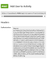

# Landrup Dans  
Denisse Daugaard – WU13  

## Introduktion  

Landrup Dans er en moderne webapplikation udviklet til håndtering af dansehold, medlemmer og instruktører.  
Systemet gør det muligt for brugere at oprette sig, logge ind og tilmelde sig hold, mens instruktører kan oprette og administrere deres egne hold samt se deltagerlister.  

Applikationen er udviklet med fokus på brugervenlighed, performance og en struktureret kodebase.

---

## Tech Stack  

Projektet er udviklet med følgende teknologier:

- **Next.js**  
  Et React-baseret JavaScript framework, der er komponentbaseret og benytter file-based routing.  
  Next.js understøtter både client-side og server-side rendering samt API routes, hvilket gør det velegnet til fullstack-applikationer.

- **React**  
  Bruges til at opbygge genanvendelige UI-komponenter og håndtere applikationens state.

- **Tailwind CSS**  
  Et utility-first CSS framework, der gør det hurtigt og effektivt at style applikationen direkte i komponenterne.

- **Zod**  
  Et schema validation library, der bruges til validering af formularer og sikrer korrekt og typesikker datahåndtering.

- **REST API**  
  Applikationen kommunikerer med et eksternt API via flere requests til håndtering af brugere, hold og tilmeldinger.

---

## Hvorfor har vi valgt Next.js?

Jeg har valgt Next.js fordi:

- **Indbygget API-håndtering**  
  Gør det nemt at arbejde med serverlogik og API-kald i samme projekt.
  De prekonstruerede fetch hook gør det nemmere.

- **File-based routing**  
  Giver en overskuelig og struktureret måde at håndtere routing på.

- **Performance**  
  Mulighed for server-side rendering og optimering.

- **Skalerbarhed**  
  Velegnet til både små og større applikationer.

---

## Brugerroller

Systemet understøtter to typer brugere:

- **Medlem**
  - Kan oprette bruger
  - Kan logge ind.
  - Kan tilmelde sig hold.
  - kan se listen over deltagere
  - kan fjernes fra aktiviteten

- **Instruktør**
  - Kan logge ind
  - Kan ikke tilmelde sig aktiviteterne

---


# Kode eksempel 1 .
```js
export async function postJSON(url, body, token) {
  try {
    const res = await fetch(url, {
      method: "POST",
      headers: {
        "Content-Type": "application/json",
        ...(token && { Authorization: `Bearer ${token}` }),
      },
      body: JSON.stringify(body),
    });

    const contentType = res.headers.get("content-type") || "";
    const isJson = contentType.includes("application/json");

    const data = isJson ? await res.json().catch(() => null) : null;
    const text = !isJson ? await res.text().catch(() => null) : null;

    if (!res.ok) {
      const message = (data && (data.message || data.error)) ||text || "Noget gik galt ved oprettelsen af data";
      return { ok: false, status: res.status, data, text: message };
    }

    return { ok: true, status: res.status, data, text };
  } catch (error) {
    return {
      ok: false,
      status: 0,
      data: null,
      text: "Netværksfejl: kunne ikke oprette forbindelse til serveren",
    };
  }
}
```

---

# Forklaring

## Hvad er dette?

Dette er en global asynkron hjælpefunktion kaldet `postJSON`.

Funktionen bruges til at sende en HTTP POST request til en server med data i JSON-format.

Den er lavet som en genbrugelig funktion, så man kan kalde den fra flere steder i applikationen, når man skal sende data til et API.

Funktionen bruger:

- `async/await`
- `fetch()`
- `JSON.stringify()`
- Dynamisk Authorization header
- Mulighed for at tilføje en token, hvis det er nødvendigt.
- `try/catch` til fejlhåndtering

---

## Hvad er målet?

Målet med funktionen er at:

1. Sende data til serveren via en POST request
2. Sikre at data sendes i korrekt JSON-format
3. Håndtere både JSON- og tekst-responses
4. Returnere et ensartet response-objekt
5. Håndtere netværksfejl

Sammenfattende er formålet at skabe en standardiseret og sikker måde at sende POST-requests på i hele applikationen.

---

## Hvad sker her?

### 1. Der sendes en POST request

Funktionen bruger `fetch()` med metoden `"POST"`.

---

### 2. Headers bliver sat

- `"Content-Type": "application/json"` fortæller serveren at body er JSON.
- Hvis der findes et token, tilføjes `"Authorization": "Bearer token"`.
```js
...(token && { Authorization: `Bearer ${token}` })
```
Her er et eksempel på brug.
I dette tilfælde kræver request et token, men ingen data i body.

 

```js 
//action.js
const userId = cookieStore.get("userId")?.value;
const url = `http://localhost:4000/api/v1/users/${userId}/activities/${activityId}`;
const token = cookieStore.get("token")?.value;

const response = await postJSON(url, {}, token);

// {} Det tomme objekt er den del af feltet, der ikke er nødvendigt for denne POST-request.
```

---

### 3. Body konverteres til JSON

`JSON.stringify(body)` konverterer JavaScript-objektet til JSON før det sendes.

---

### 4. Response-type bliver tjekket
```js
const contentType = res.headers.get("content-type") || ""
const isJson = contentType.includes("application/json");
```
To `const` oprettes: `data` og `text`. Deres indhold vil kun være `null`, hvis anmodningen mislykkes.
Dette undgår funktionen at chaser.

```js
const data = isJson ? await res.json().catch(() => null) : null;
const text = !isJson ? await res.text().catch(() => null) : null;

// dette er en renere version af dette


let data = null;
let text = null;

if (isJson) {
  try {
    data = await res.json();
  } catch {
    data = null;
  }
} else {
  try {
    text = await res.text();
  } catch {
    text = null;
  }
}

```

Hvis serveren svarer med JSON → bruges `res.json()  
Ellers → bruges `res.text()`

---

### 5. Der returneres et objekt

Funktionen returnerer altid:

- `ok`
- `status`
- `data`
- `text`

---

### 6. Fejlhåndtering

Hvis der opstår en fejl, returneres:

```js
{
  ok: false,
  data: null,
  status: 400, 404, 401, 500, etc. // afhængig af fejlen
  text: "Der skete en fejl ved indlæsning af data" // afhængig af fejlen
}
```

---

### 7. De to typer fejlhåndtering
- ### Hvad gør `try/catch` egentlig?
Vi nåede slet ikke frem til serveren.”
```js
try {
   // kode, der muligvis fejler
} catch (error) {
   // kører kun, hvis noget giver en fejl
}
```

- ### Hvad håndterer `if (!res.ok)`?
Tjeneren svarede, men sagde, at noget var gået galt
```js
 if (!res.ok) {
      return { ok: false, status: res.status, data, text: message };
    }

  //eller

 if (!res.ok) {
    throw new Error("Det var ikke muligt at oprette data");
    
    }

```
***postJSON bruges i flere komponenter, [here](./src/app/login/action.js) er et eksempel.
***


---
# Kode eksempel 2
```js
  const handleSubmitAndClose = async () => {
        if (!actId) {
            setErrorMessage("Aktivitets ID mangler");
            return;
        }

        setIsDeleting(true);
        const response = await deleteUserFromActivity(actId);

        if (!response?.ok) {
            setErrorMessage(response?.text || "Der skete en fejl");
            setIsDeleting(false);
            return;
        }
        handleClose();
    }
```

## Forklaring

## Hvad er dette?

Dette er en asynkron client funktion kaldet `handleSubmitAndClose`.  
Funktionen håndterer sletning af en bruger fra en aktivitet og lukker derefter et vindue , i dette tilfælde en modal hvis handlingen lykkes.

Funktionen bruger:
- `async/await` til at håndtere en asynkron API-kald
- State-håndtering (`setErrorMessage`, `setIsDeleting`)
- En ekstern funktion `deleteUserFromActivity` til at udføre selve sletningen

---

## Hvad er målet?

Målet med funktionen er at:

1. Tjekke om der findes et aktivitets-ID (`actId`)
og opret en besked til brugeren, hvis det pågældende ID ikke findes
2. Kalde en funktion, der fjerner brugeren fra aktiviteten
3. Håndtere fejl, hvis noget går galt
4. Lukke vinduet (modalen), hvis sletningen lykkes

Sammenfattende formålet er  altså at sikre en kontrolleret og sikker sletning af en bruger fra en aktivitet med korrekt fejlhåndtering.

---

## Hvad sker her?

1. Først tjekkes det, om `actId` findes.  
   - Hvis ikke, vises en fejlmeddelelse (` setErrorMessage("Aktivitets ID mangler")`), og funktionen stopper.

```js
    {errorMessage && (
      <button className="btn bg-gray-500 text-white" onClick={handleClose}>Luk</button>
    )}
```


2. `setIsDeleting(true)` sættes for at indikere, at en sletning er i gang 
```js
{isDeleting && (
  <button className="btn disabled:bg-gray-500 bg-red-50 text-white" 
    onClick={handleSubmitAndClose} 
    disabled={isDeleting}>
    {isDeleting ? "Sletter..." : "Ja, slet"}
  </button>
)}
```


3. Funktionen `deleteUserFromActivity(actId)` kaldes og gemmes i `response`.

4. Hvis svaret ikke er OK:
   - Der vises en fejlmeddelelse


   - sættes  `setIsDeleting(false)`
   - Funktionen stopper

5. Hvis alt lykkes:
   - `handleClose()` kaldes, som lukker modalvinduet.


***handleSubmitAndClose funktionen bruges i denne komponent
[here](./src/app/components/landrupdans-pages/profile-components/delete-activity/DeleteModal.jsx)***


